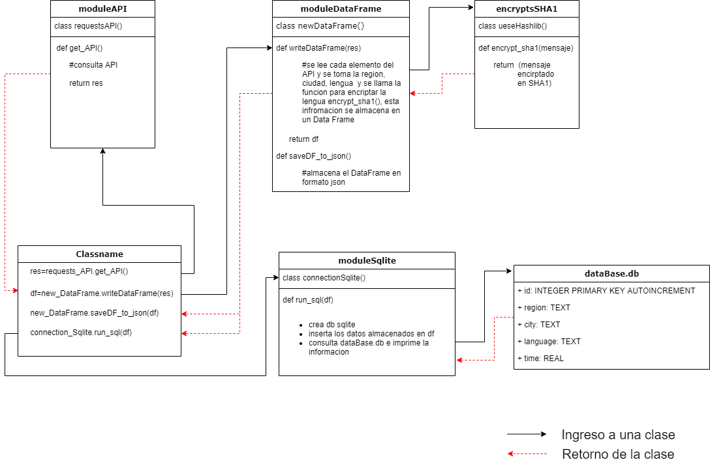

# Prueba Tecnica - ZINOBE


## Objetivo

Desarrollo una aplicacion en python que genera la tabla teniendo las siguientes consideraciones:

De https://restcountries.com/ obtenga el nombre del idioma que habla el pais y encriptelo con SHA1

- En la columna Time ponga el tiempo que tardo en armar la fila (debe ser automatico)
- La tabla debe ser creada en un DataFrame con la libreria PANDAS
- Con funciones de la libreria pandas muestre el tiempo total, el tiempo promedio, el tiempo minimo y el maximo que tardo en procesar toda las filas de la tabla.
- Guarde el resultado en sqlite.
- Genere un Json de la tabla creada y guardelo como data.json
- La prueba debe ser entregada en un repositorio git.

## Ejecutar el proyecto


```
python run.py
```

## Archivos de salida 

### Resultado en sqlite
- la apliacion genera una carpeta llamada 'db_Sqlite' donde se almacena el resultado en sqlite con el nombre 'dataBase.db
'

```
 ./db_Sqlite/dataBase.db
```
###  Resultado en Json
- la apliacion genera una carpeta 'db_Json' donde se almacena la tabla en formato Json con el nombre  'data.json'

```
 ./db_Json/data.json
```
## Diseño de la solucion.




